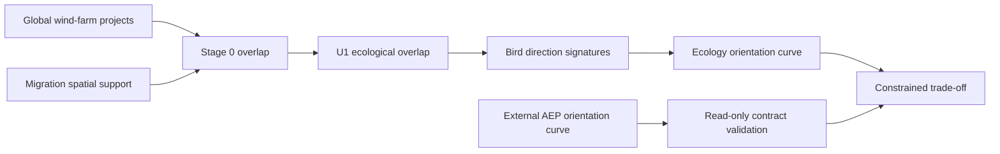

# Architecture and repository boundary

## Two repositories, two scientific responsibilities

The engineering repository owns wind-resource processing, layout rotation, wake modelling and the AEP response curve. This ecology repository owns migratory receptors, spatial overlap, direction signatures, behaviour, exposure and ecological response curves. The separation is intentional because changes in bird-data assumptions must not trigger a rerun of the wake model, and changes in FLORIS or ERA5 processing must not alter bird-data provenance.

The only connection is a versioned data artifact. The engineering repository exports an AEP curve with one row per farm and axial orientation. This repository validates the column contract, aligns it with an independently produced ecological curve and computes the constrained trade-off. It never imports an engineering source module or reaches into an engineering output directory at runtime.

## Pipeline

## Stable join keys

The preferred join key is a persistent `farm_id` maintained in a crosswalk table. Orientation angles are axial and normalized to the half-open interval `[0, 180)`. Bird headings remain directed on `[0, 360)` in the bird contract; they are converted to axial distance only when compared with a row axis. Season is never silently aggregated because spring and autumn headings can cancel in an ordinary circular mean even though they share the same physical corridor axis.

## Migration policy

Legacy engineering scripts remain in the engineering repository. Their outputs can be converted to the AEP contract by an explicit export step there. Bird code, literature notes and ecological outputs belong here. No large raw data or licensed tracking datasets are committed to Git.

