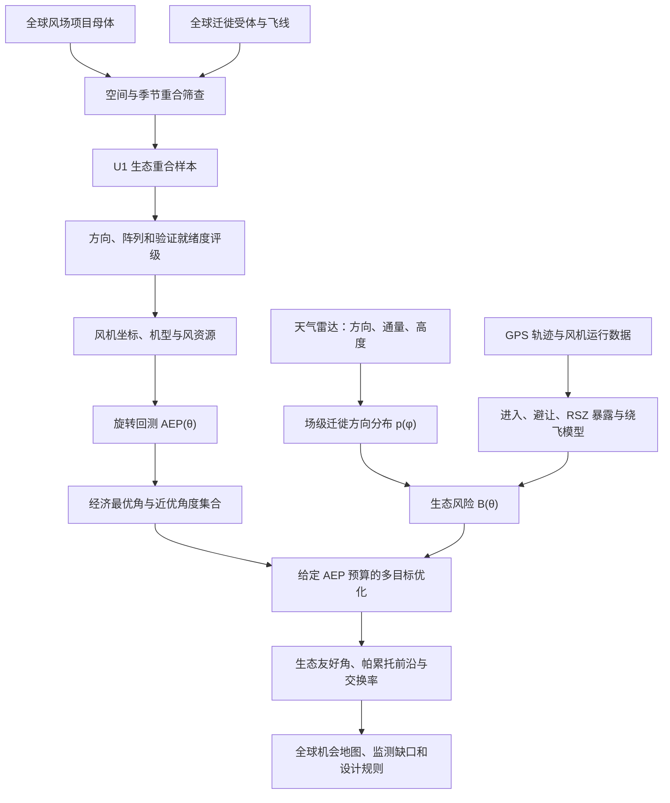

# 研究方案：全球风机阵列方向的能源—生态交换率

## 拟定题目

**全球迁徙鸟—风场重合区的阵列方向优化与能源—生态交换率**

英文工作题目可暂定为 *Global overlap of bird migration and wind farms reveals opportunities for low-cost ecological reorientation*。在获得结果之前，题目使用“风险”或“生态机会”而不是“提升生物多样性”，以免把空间重合或暴露代理提前解释为种群和生态系统结果。

> [!abstract] 方案摘要
> 本研究拟检验风机阵列方向能否成为一种低成本的建设前生态设计杠杆。研究首先构建全球迁徙鸟与风场的空间重合母体，并将生态重合、方向可识别性、阵列数据完整性和行为验证条件分别评级。只有进入研究母体的风场才开展阵列旋转回测，构建年发电量响应曲线 $AEP(\theta)$ 及近优角度集合。天气雷达和 GPS 轨迹进一步提供场级飞行方向、通量、旋翼高度比例及避让行为，用于估计阵列—飞向夹角对进入、旋翼扫掠区暴露和绕飞的影响。研究最终在给定发电损失预算下求取生态友好角，并计算每损失 1 GWh 所避免的预期碰撞或保护加权风险。该设计不预设平行机排一定最优，而是比较“平行走廊”和“宏观屏障”两类竞争机制，识别全球哪些迁徙鸟—风场重合区能够以有限发电让步获得不成比例的生态收益。

## 1. 研究背景与中心问题

风电场的阵列方向通常围绕主导风向和尾流损失进行优化，生态缓解则多集中于敏感区域避让、运行期停机和鸟类驱离。[[Bauer et al 2026-雷达驱动的鸟能权衡]]表明，精准停机能够以约 1.2% 或 7.6% 的电量损失避免 50% 或 90% 的潜在碰撞，说明能源—鸟类保护之间可能存在高度有利的交换关系。然而，停机属于运行期措施，必须持续支付发电代价。阵列朝向若在建设前确定，则可能在资本投入和占地基本不变的条件下形成长期收益。

方向杠杆的生物学基础来自鸟类飞行的方向性。[[Santos et al 2022-迁徙黑鸢平行机排飞行与避让]]观察到迁徙黑鸢会在接近风机时改变航向，并在部分区域平行机排飞行以避开旋翼扫掠区。该结果说明鸟类风险可能不仅由当地丰度决定，还取决于飞行方向与阵列方向的相对关系。不过，现有研究没有系统量化旋转阵列对发电与鸟类风险的联合影响，也没有验证平行走廊、宏观避让和屏障代价之间的净效应。

本研究的中心问题是：**在全球迁徙鸟与风场实际重合的区域内，如果年发电量只允许小幅下降，能否通过调整风机阵列方向显著降低迁徙鸟类的碰撞暴露或保护加权风险？** 该问题分解为四个相互衔接的任务。研究首先确定全球哪些风场与迁徙通道发生空间和季节重合，并区分生物学上的重合与数据上的可观测性。随后识别入选风场是否存在低成本的角度自由度，检验阵列—飞向夹角是否稳定改变鸟类行为和危险暴露，最后把经过验证的生态收益换算为发电机会成本。

## 2. 研究范围与分析单位

研究以具有明确主轴的规则或近规则风机阵列为主要对象，生态受体限定为具有稳定季节飞行方向的迁徙鸟类。阵列方向属于 180° 周期的轴向数据，因此 $\theta$ 与 $\theta+180^\circ$ 等价。珊瑚礁、底栖生境、海缆电磁影响和永久栖息地占用不纳入生态最优角，而应由租区形状和占地反事实单独处理，相关边界见 [[07-反证与失败条件]]。

研究范围为全球，并采用“全球母体识别—模型就绪样本—重点案例验证”的嵌套设计。全球层覆盖可获得位置的运行、建设和规划风场，用于识别迁徙鸟—风场重合区域。模型就绪层只保留能够估计迁徙方向、取得阵列坐标并构建 $AEP(\theta)$ 的风场。重点验证层从各主要迁徙系统中分层选择具有雷达、GPS、风机运行或死亡数据的案例，而不是预先限定在欧洲。GPS 轨迹用于估计物种级行为，天气雷达用于提供总体方向、通量和高度分布，两类数据不能相互替代。

## 3. 阶段0：构建全球迁徙鸟—风场研究母体

阶段0决定后续研究“在哪里做、对哪些风场做、能够声称什么”。全球所有风场不是天然的研究样本，只有与迁徙鸟空间范围和迁徙季节发生重合的风场才具有生态问题。与此同时，缺少公开鸟类数据不等于不存在迁徙风险。因此阶段0必须分别绘制生态重合图和数据就绪度图，避免数据丰富的欧洲和北美在样本中被误认为生态风险最高的区域。

### 3.1 全球风场母体

全球风场第一层母体使用 [[Global Wind Power Tracker-全球风场项目母体]]。该数据覆盖全球 10 MW 以上的公用事业级陆上和海上风电项目，并区分运行、建设、建设前和已公布等阶段。项目级坐标足以完成全球重合筛查，但其位置精度不一，且通常不能提供逐台风机坐标。因此阶段0使用项目点及多尺度缓冲区，进入阵列分析后再以 OpenStreetMap、政府许可文件、开发商资料或区域权威数据库补齐真实风机坐标。

风场母体分成两个用途不同的队列。运行风场构成行为与死亡验证队列，因为可以观察鸟类对既有阵列的反应。建设前、已公布和部分在建项目构成设计干预队列，因为阵列方向仍可能被调整。二者在全球地图上同时展示，但统计分析和政策含义分别报告。

### 3.2 全球迁徙受体母体

全球迁徙受体首先由 [[BirdLife-迁徙飞线与能源敏感性工具]]建立物种、迁徙系统和敏感区域名录。BirdLife 识别的陆地和海洋飞路适合全球分层，但边界过宽，只能作为抽样框架，不能直接当作场址级重合或主飞行方向。更细的迁徙空间支持来自公开 Movebank 轨迹、可取得的物种级迁徙走廊、卫星追踪图层以及 eBird 周尺度分布的季节位移。Movebank 轨迹可直接计算方向但不能代表总体通量，eBird 可以补充季节范围和物种出现，却不能替代个体航向。

对每个物种或功能群 $s$ 和迁徙阶段 $t$，阶段0构造迁徙空间支持 $M_{s,t}$。若存在多只个体轨迹，则对清洗后的迁徙段生成带不确定缓冲的轨迹包络；若只有季节分布，则依据繁殖季与非繁殖季分布变化构造宽尺度通行区域，并将证据等级标为较低。全球飞路不用于生成精确碰撞截面，只用于保证不同迁徙系统、半球、海陆环境和纬度带均被纳入抽样。

### 3.3 空间与季节重合

风场 $f$ 的空间支持记为 $W_f^{(r)}$。有逐台风机坐标时，使用阵列凸包或实际边界并增加风险缓冲；只有项目坐标时，分别采用多个缓冲尺度开展敏感性分析。物种—风场空间重合定义为：

$$
O_{f,s,t}(r)=
\frac{\operatorname{Area}\left[W_f^{(r)}\cap M_{s,t}\right]}
{\operatorname{Area}\left[W_f^{(r)}\right]}.
$$

空间相交只是必要条件。只有当风场所在地的鸟类通过时间与物种迁徙季重合时，才记为有效暴露事件。对于只有轨迹中心线的数据，同时计算风场到迁徙轨迹的最短距离及其不确定区间。阶段0不使用这一重合比例推断死亡，只用它定义后续分析母体和排序调查优先级。

### 3.4 四级样本漏斗

| 样本层级 | 纳入条件 | 主要用途 | 不能声称的内容 |
|---|---|---|---|
| U0 全球风场母体 | 全球项目位置和状态可获得 | 描述全球风电项目分布 | 不代表存在鸟类风险 |
| U1 生态重合样本 | 与至少一种迁徙受体在空间和季节上重合 | 全球冲突区和空白区识别 | 不能说明方向效应 |
| U2 方向就绪样本 | 可估计场级或区域级 $p(\phi)$，并记录证据等级 | 构造候选生态方向 | 不能说明真实碰撞下降 |
| U3 工程就绪样本 | 有逐机坐标、机型、风资源和 $AEP(\theta)$ 条件 | 计算双角冲突和低成本机会 | 仍需行为验证 |
| U4 验证就绪样本 | 有雷达/GPS、运行状态或死亡数据 | 估计进入、避让、暴露和死亡响应 | 外推须经跨风场验证 |

每个风场分别记录生态重合置信度、方向证据等级、阵列数据完整度和行为验证能力，而不是把四项压缩成一个不透明总分。全球主图至少包含两张并列地图。一张显示潜在生态重合，另一张显示数据就绪度。二者的差异本身就是重要结果，因为它能够识别生态上重要但数据贫乏的全球监测缺口。

### 3.5 全球分层抽样

进入精细分析的风场按迁徙系统、半球、纬度带、陆上或海上、地形类型、项目状态和数据等级分层抽取。验证样本不能只选择数据最丰富的国家，否则得到的角度响应可能无法推广到全球。主分析可对可观测样本估计效应，同时使用覆盖概率加权、分层汇总和缺失机制敏感性分析评估数据地理偏差。对完全缺乏方向数据的重合区，研究只报告监测优先级，不填补虚构方向。

## 4. 研究问题与可证伪假设

| 编号 | 研究问题 | 预注册假设或竞争假设 | 可否证结果 |
|---|---|---|---|
| H0 | 全球迁徙鸟与风场在哪里发生有效重合？ | 重合集中于有限的迁徙通道—风电建设交汇区，且生态重合与数据就绪度的地理分布不同 | 重合近似均匀，或不同空间定义下极不稳定 |
| H1 | 哪些风场的朝向调整最便宜？ | 风玫瑰越集中，$AEP(\theta)$ 峰值越尖；风向越分散，近优角度集合越宽 | 风玫瑰集中度不能解释 AEP 平顶宽度 |
| H2a | 平行机排是否形成安全走廊？ | 在旋翼高度内，危险暴露随 $d_{180}(\theta,\phi)$ 从 0°向 90°增加 | 夹角无效，或 0°附近暴露反而更高 |
| H2b | 墙状阵列是否触发宏观屏障？ | 较大的夹角可能降低阵列进入率，但增加转向角、绕飞距离和功能性栖息地损失 | 进入率和绕飞均不随夹角变化 |
| H3 | 小额发电让步是否产生不成比例的生态收益？ | 在部分风场中，0.5%–2% 的 AEP 预算可获得明显大于成本比例的风险下降 | 风险下降近似线性或显著小于 AEP 损失 |
| H4 | 哪些场址最值得调整方向？ | AEP 平顶宽、迁徙方向集中且当前两角冲突大的风场具有最高生态机会 | 三个条件不能预测可实现的风险下降 |

H2a 与 H2b 是竞争机制，而不是必须同时成立的假设。研究不以证明“平行一定最好”为目标，而是估计阵列—飞向夹角对进入、暴露、碰撞和绕飞的完整响应面。如果夹角只改变宏观进入率而不改变进入后的危险暴露，生态优化应转向屏障—碰撞的双目标问题。

## 5. 总体技术路线

整个方案由阶段0和四个后续工作包组成。阶段0构建全球研究母体并完成重合筛查，第一工作包构建发电方向响应面，第二工作包构建鸟类方向和行为响应，第三工作包完成两条曲线的联合优化，第四工作包进行外部验证、不确定性传播和全球推广。各阶段按证据强度逐级推进，只有行为模型通过验证后，才把几何暴露解释为生态风险。

## 6. 工作包一：经济方向响应与低成本角度集合

每个风场沿用既有旋转回测，在 $[0,180^\circ)$ 内以 1°或更细步长获得 $AEP_f(\theta)$。经济最优角定义为：

$$
\theta_{econ,f}=\arg\max_\theta AEP_f(\theta).
$$

本研究不直接把无约束的生态最优角当成可实施方案，而是在允许的相对发电损失 $\varepsilon$ 下定义近优角度集合：

$$
\Theta_{f,\varepsilon}=\left\{\theta:AEP_f(\theta)\geq(1-\varepsilon)AEP_f(\theta_{econ,f})\right\}.
$$

$\varepsilon$ 预设为 0.1%、0.5%、1%、2% 和 5%，从而回答在不同发电预算下有多少生态设计自由度。AEP 平顶宽度、风玫瑰集中度、主导风向数量、阵列长宽比和行列间距将用于解释风场间差异。AEP 模型的不确定性通过风年重采样、尾流模型替换和关键参数抽样传递到近优角度集合，避免把单条确定性曲线误作真实收益面。

## 7. 工作包二：迁徙方向与生态响应函数

### 7.1 场级方向输入

天气雷达提供迁徙方向分布 $p_{f,s,t}(\phi)$、季节或事件通量 $F_{f,s,t}$ 以及处于旋翼高度的比例 $q_{f,s,t}$。方向分布是生态角的核心输入，通量只需作为场级或事件级标量，不要求高分辨率二维密度图。Movebank GPS 数据负责描述物种级转向、最近机距、飞行高度和绕飞行为，BirdLife 与 eBird 仅用于敏感物种、迁徙季节和保护权重的辅助筛选，具体边界见 [[04-数据源与可获得性]]。

大陆尺度飞线只能用于生成先验角。进入重点案例后，研究将用雷达或 GPS 重新估计风场边界附近的实际来向，并比较粗尺度方向与场级方向的偏差。如果场级方向在不同天气和迁徙阶段发生明显旋转，则生态输入将采用完整方向分布，而不是单一平均方位。

### 7.2 几何暴露模型

初步筛查不采用未经验证的单一正弦函数，而是根据真实风机坐标进行方向射线模拟。对每个候选阵列角 $\theta$ 和飞行方向 $\phi$，从阵列迎鸟侧边界均匀抽取进入点，计算直线轨迹可能遇到的旋翼影响区数量、最小机距、阵列穿越深度和可用通道宽度。该过程生成几何暴露 $X_f(\theta,\phi)$，再按方向分布和场级通量加权：

$$
E^{geo}_f(\theta)=\sum_{s,t}w_sF_{f,s,t}q_{f,s,t}
\int X_f(\theta,\phi)p_{f,s,t}(\phi)\,d\phi.
$$

$w_s$ 是透明报告的物种保护权重。主分析应同时报告不加权鸟数结果，防止权重选择主导结论。几何暴露只用于机会筛查，不能单独被称为碰撞死亡或生物多样性收益。

### 7.3 行为效应识别

行为验证优先利用同一风场内不同迁徙事件的来向变化。阵列本身固定，而季节、天气和日际变化使鸟以不同夹角接近风场，因此可以在控制场址固定特征后估计相对角效应。主要模型为分层广义加性模型：

$$
\operatorname{logit}P(enter_i)=\alpha_{farm}+u_{species}+f\!\left[d_{180}(\theta_f,\phi_i)\right]+\boldsymbol{x}_i^{\mathsf T}\boldsymbol{\beta},
$$

其中 $\boldsymbol{x}_i$ 包括风速、侧风和顺逆风分量、能见度、昼夜、飞行高度、季节、风机运行状态、行列间距及地形。阵列进入使用二项模型，旋翼扫掠区穿越次数使用带通量偏置项的负二项模型，最近机距和绕飞距离分别使用适合其分布的连续响应模型。场址和物种设置分层效应，并采用留一风场交叉验证检验外推能力。

这一识别策略并非随机旋转实验。来向可能与风、天气和迁徙阶段共同变化，因此研究将使用精细气象控制、同季节窄时间窗匹配和场址固定效应减少混杂。高于旋翼高度的轨迹作为负对照，因为若观测到的夹角效应确由碰撞避让驱动，其效应应明显弱于旋翼高度内的轨迹。非迁徙季和随机打乱方向也作为安慰剂检验。

### 7.4 从避让到碰撞风险

经过行为校正的物种风险定义为：

$$
B_f(\theta)=\sum_{s,t} w_sF_{f,s,t}q_{f,s,t}
P_{enter,s}(\theta,\phi)
P_{RSZ,s}(\theta,\phi\mid enter)
P_{collision,s}(\theta,\phi\mid RSZ).
$$

[[Mercker et al 2026-红鸢微观与中观避让率]]可用于设定避让参数的先验范围，但主分析不把红鸢参数直接外推到全部物种。有尸体搜索数据的风场将按照搜索效率和尸体存留时间进行校正，用来校准预期风险与真实死亡之间的关系，方法参考 [[Roy et al 2025-热带荒漠风场鸟类死亡]]。没有死亡数据时，结果明确报告为“保护加权暴露”或“预期碰撞风险”。

屏障代价单独定义为绕飞增加的距离或估计飞行能耗：

$$
B_{barrier,f}(\theta)=\sum_{s,t} w_sF_{f,s,t}\Delta L_{f,s,t}(\theta).
$$

碰撞与屏障在主结果中并列展示，不通过未经验证的权重强行合成。只有在管理目标给出明确偏好后，才提供组合情景。

## 8. 工作包三：受发电预算约束的生态优化

对每个风场和每个发电预算 $\varepsilon$，生态友好角定义为：

$$
\theta^*_{eco,f}(\varepsilon)=
\arg\min_{\theta\in\Theta_{f,\varepsilon}} B_f(\theta).
$$

相对于经济最优角的生态收益为：

$$
G_f(\varepsilon)=1-
\frac{B_f[\theta^*_{eco,f}(\varepsilon)]}
{B_f(\theta_{econ,f})}.
$$

绝对发电让步和交换率分别为：

$$
C_f(\varepsilon)=AEP_f(\theta_{econ,f})-
AEP_f[\theta^*_{eco,f}(\varepsilon)],
$$

$$
\eta_f(\varepsilon)=
\frac{B_f(\theta_{econ,f})-B_f[\theta^*_{eco,f}(\varepsilon)]}
{C_f(\varepsilon)}.
$$

当发电损失接近零时，比值可能数值不稳定，因此主结果应同时展示完整帕累托前沿、绝对 GWh 损失和风险下降比例。研究将重点报告 0.5%、1% 和 2% 发电预算下的可实现收益，而不是只给一个不受约束的 $\theta_{eco}$。场址层结果进一步用于估计哪些风场最可能出现“高收益、低成本”区域，并检验 AEP 平顶宽度、迁徙方向集中度和初始角度冲突是否具有稳定预测力。

## 9. 主要指标与证据等级

| 结果维度 | 主指标 | 单位 | 可以支持的表述 |
|---|---|---|---|
| 经济 | 年发电让步 | GWh yr⁻¹、% AEP | 生态方向的能源机会成本 |
| 几何 | 风机影响区相交次数、阵列穿越深度 | 次、m | 方向造成的潜在几何暴露 |
| 行为 | 进入率、最近机距、转向角、绕飞距离 | %、m、度、km | 鸟类对相对角的行为响应 |
| 风险 | 旋翼扫掠区穿越或预期碰撞 | 次 season⁻¹ | 迁徙鸟类风险下降 |
| 死亡 | 偏差校正死亡数 | birds yr⁻¹ | 预期或实测死亡变化 |
| 种群 | 年死亡占种群比例、增长率或准灭绝风险 | %、$\lambda$ | 只有具备种群模型时才可声称种群收益 |

论文的默认主生态指标建议采用“保护加权的旋翼扫掠区穿越风险”，因为它比单纯角差更接近碰撞，又比真实死亡更容易在多风场获得。若重点案例具有可靠死亡数据，应将“每损失 1 GWh 避免的预期死亡数”作为增强结果。若只有方向而缺少通量和高度，研究只能停留在机会筛查层，不能声称实现了显著生态收益。

## 10. 样本设计与数据需求

全球筛查层纳入阶段0能够获得位置和项目状态的全部公用事业级风场，而不是预先限制样本数量。U1 将给出全球生态重合风场数量和地理分布，U2 与 U3 则分别反映方向数据和工程数据的可得性。精细 AEP 分析可先以 50–100 个分层代表性 U3 风场为首批样本，再随阵列数据补齐逐步扩展。行为验证层建议从不同迁徙系统选择 8–15 个在阵列方向、机型、间距和迁徙来向上具有充分差异的 U4 风场，并覆盖至少两个迁徙季。有效样本量应以风场进入事件或独立轨迹段计算，而不是 GPS 点数；正式阈值将在获得先导数据后通过模拟功效分析确定。

高质量验证样本需要覆盖从接近平行到接近正交的完整夹角范围，并保证旋翼高度内具有足够事件数。如果某个风场只有单一狭窄来向，它仍可用于估计场级风险，但不能单独识别完整角度响应。GPS 个体样本与雷达总体通量将分别建模，避免把被追踪个体数量误当成迁徙种群通量。

## 11. 稳健性与不确定性分析

模型稳健性将围绕六类不确定性展开。阶段0首先检验风场点位精度、缓冲半径、迁徙空间支持和季节窗口对全球重合格局的影响。方向不确定性通过改变时间窗口、雷达高度层和粗细尺度方向来源检验。阵列不确定性通过主轴提取方法、角度步长、边界形状和不规则阵列排除标准检验。行为不确定性通过平行走廊、投影截面、宏观屏障和物种特异避让四类竞争模型检验。生态权重不确定性通过等权、保护等级权重和种群脆弱性权重比较。经济不确定性则通过风年、尾流模型和可用率的联合抽样传播。

最终结果采用分层自助法或贝叶斯后验抽样，把方向、通量、行为参数、AEP 和物种权重的不确定性共同传播到 $\theta^*_{eco}$、生态收益和交换率。除总体均值外，还应报告风场层中位数、分位区间以及在不同 AEP 预算下“生态收益为正”的场址比例。留一风场验证和空间分块验证用于检验模型能否推广到未见风场。

## 12. 预注册的失败条件与解释

如果夹角对阵列进入、最近机距、旋翼扫掠区穿越和绕飞距离均无稳定效应，则应得出“阵列朝向不是有效生态杠杆”的结论，并把研究重点转向精准停机。若效应方向在物种间相反且不能由飞行类群或高度解释，则不应报告单一生态最优角，而应给出物种或功能群的帕累托前沿。若风险下降伴随明显的绕飞和屏障代价，结果必须作为碰撞—屏障权衡呈现。若多数风场在 1% AEP 预算内没有可辨识的风险下降，则“低成本高收益”只适用于特定机会型场址，而不是普遍设计原则。

粗尺度迁徙方向与场级来向若存在大幅偏差，区域筛查结果只能作为候选场址排序。实际工程建议必须以场级方向校准为前提。这些失败结果仍具有发表价值，因为它们能够确定角度设计的适用边界，并防止资源被投入无效的生态优化。

## 13. 预期结果与图件设计

| 主图 | 科学问题 | 建议内容 |
|---|---|---|
| 图 1 | 全球哪里存在研究对象？ | 全球风场、迁徙空间支持、生态重合区与数据就绪度并列地图 |
| 图 2 | 双角冲突如何形成交换率？ | 风玫瑰、迁徙方向、阵列旋转及 $AEP(\theta)$/$B(\theta)$ 概念图 |
| 图 3 | 哪些风场存在低成本角度自由度？ | 多风场 AEP 响应面、平顶宽度和近优角度集合地图 |
| 图 4 | 相对角是否改变鸟类行为？ | 进入率、最近机距、RSZ 穿越与绕飞对 $d_{180}$ 的响应曲线 |
| 图 5 | 少量发电让步能换取多少风险下降？ | 0.5%、1%、2% 预算的帕累托前沿及场址分布 |
| 图 6 | 何时值得调整方向？ | AEP 平顶、鸟向集中度和角度冲突对生态机会的解释模型 |

结果章节可按图件组织为五个发现性小节。第一节确定全球迁徙鸟—风场重合格局及数据盲区。第二节回答 AEP 平顶是否普遍存在及其成因。第三节回答阵列—飞向夹角是否改变鸟类进入、危险暴露和绕飞。第四节报告给定发电预算下的生态收益和交换率。第五节解释跨风场异质性并给出适用场址的识别规则。

## 14. 创新点

本研究的概念创新是把阵列方向从单纯尾流优化变量扩展为能源与迁徙生态的共同设计变量。全球尺度创新是先建立迁徙鸟—风场的空间和季节重合母体，再从中识别方向与工程数据就绪的研究样本，避免从数据丰富地区反向定义全球问题。方法创新是把轴向角数据、真实阵列几何、鸟类方向分布、行为避让和 AEP 响应面置于同一个可证伪框架。决策创新是在给定 AEP 预算下求解生态友好角，而不是脱离经济约束寻找抽象生态最优。多尺度创新是用全球粗数据完成机会筛查，再用少数高分辨率雷达、GPS 或死亡案例校准，从而避免全球分析对统一高分辨率密度图的依赖。

相对于 [[Bauer et al 2026-雷达驱动的鸟能权衡]]，本研究把时间停机杠杆改为建设前空间设计杠杆。相对于 [[Santos et al 2022-迁徙黑鸢平行机排飞行与避让]]，本研究把单物种行为观察扩展为跨风场角度响应和能源成本定价。相对于 [[Katzner et al 2025-陆上风电对生物多样性的影响综述]]，本研究提供一个可操作、可量化且具有明确证据边界的设计变量。

## 15. 实施计划

| 阶段 | 建议周期 | 主要产出 |
|---|---:|---|
| 阶段0数据盘点 | 第 1–2 月 | 全球风场与迁徙数据清单、许可证和变量字典 |
| 全球重合与样本分级 | 第 3–5 月 | U0–U4 样本漏斗、生态重合图和数据就绪度图 |
| AEP 与方向机会筛查 | 第 6–9 月 | 经济最优角、AEP 平顶和候选案例地图 |
| 行为模型与案例验证 | 第 10–14 月 | 夹角—进入—暴露—绕飞响应及负对照检验 |
| 联合优化与不确定性 | 第 15–17 月 | 帕累托前沿、交换率和全球解释模型 |
| 稳健性与死亡校准 | 第 18–19 月 | 敏感性分析、重点案例和证据等级审计 |
| 论文与开放材料 | 第 20–21 月 | 主文、补充材料、代码和可复用场址指标 |

如果短期内无法获得足够的 GPS、风机运行或尸体数据，可以先完成一个最小可发表版本。该版本以全球迁徙鸟—风场重合图、已有 AEP 回测、可获得的方向数据和真实坐标几何模拟为基础，产出“全球重合区、数据盲区和低成本方向机会地图”，并明确不作死亡因果声称。完整版本再加入多风场行为验证和少数死亡案例校准，使结论从设计机会升级为经行为支持的能源—生态交换率。

## 16. 预期论文结构

论文采用接近 Nature Portfolio 的结果优先结构。引言首先提出全球风电扩张与迁徙保护的耦合矛盾，随后说明停机研究已经证明保护收益可以很便宜，但全球重合区和建设前方向设计仍未被系统识别和定价。结果部分依次呈现全球重合格局与数据盲区、AEP 平顶、鸟类方向响应、受预算约束的生态收益和场址异质性。讨论部分比较时间停机与空间旋转两类杠杆，并明确碰撞、屏障、数据地理偏差和其他生态受体的边界。方法部分完整报告全球母体构建、空间重合、方向数据、阵列几何、行为模型、AEP 回测、多目标优化与不确定性传播。

## 核心参考节点

本方案的文献基础汇总于 [[08-Nature与Science相关文献综述]]。低成本高收益的直接标杆是 [[Bauer et al 2026-雷达驱动的鸟能权衡]] 和 [[Ferrer et al 2022-定向停机以极低电量损失降低兀鹫死亡]]。方向性机制主要依据 [[Santos et al 2022-迁徙黑鸢平行机排飞行与避让]]，行为参数参考 [[Mercker et al 2026-红鸢微观与中观避让率]]。生态边界由 [[Katzner et al 2025-陆上风电对生物多样性的影响综述]]、[[Thaker et al 2018-风场跨营养级生态级联]]和 [[07-反证与失败条件]]共同限定。
